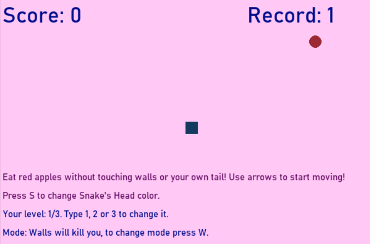
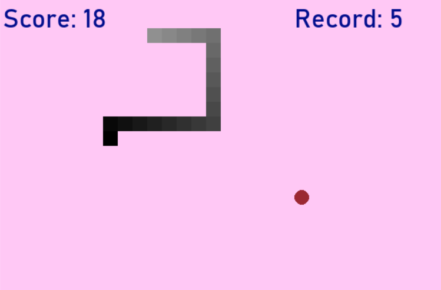

# Градиентная змейка с меняющимся фоном
[TOC]

# Описание игры
Игра представляет собой аналог классической змейки с некоторыми усовершенствованиями. Помимо роста змейки 
и увеличения ее скорости при съедании яблока, а также смерти в случае столкновения с хвостом или стенами,
в игре доступны:
* Несколько карт перегородок, усложняющих игру: при активании режима непрозрачных стен змейка погибает при столкновении с перегородкой;
* Смена цвета фона, на другой оттенок случайным образом, однако всегда выбирается светлый, чтобы у игрока не рябило в глазах;
* Смена оттенка змейки;
* Онлайн табло подсчета очков, а также табло с рекордом по нескольким играм;
* Исчезающие правила, отображающиеся перед началом игры;
* Выбор уровня сложности по скорости: начальная скорость змейки может принимать 3 значения;
* Режим "прозрачных стен": переключается кнопкой 'W', при его активации змейка может проходить сквозь стены и перегородки. Такой режим помогает пользователю отдохнуть и помедитировать, играя в змейку. 

Некоторые скриншоты: 

	

  

	

  

## Используемые технологии
* Игра написана с использованием классической игровой библиотеки pygame.  
Установка: `pip install pygame`
* Для генерации цвета фона, змейки, а также для перемещения яблока использована библиотека random.
* В проекте создана модульная файловая структура, упрощающая дебаггинг и дальнейшее переиспользование блоков кода.
* Используется функциональный подход к организации кода.
* Для начала игры необходимо запустить файл snakegame.py

## Планы по доработке
В будущем планируется создать возможность наложения дополнительных препятствий для змейки, а также режим для 2 игроков.

---
_Проект разработан студентками МФТИ Гришиной Еленой, Забариной Светланой и Шабанской Ксенией, 2022_

# Техническая документация 

## constans.py
Файл содержит основные константы: цвета, тексты, размеры, используемые в игре.
## messages.py
Содержит функции, отвечающие за отрисовку информационных сообщений на поле. Все функции ничего не возвращают.
1. `Your_score(score, dis)`  
Выводит число очков, набираемых игроком
* score, int - число очков, обязательный;
* dis - игровой дисплей, обязательный;
2. `Your_record(record, dis)`  
Выводит число очков, максимально набиранных игроком
* record, int - число очков, обязательный;
* dis - игровой дисплей, обязательный;

3. `Your_level(level, dis)`  
Выводит выбранный уровень и инструкцию по его смене
* record int - число очков, обязательный;
* dis - игровой дисплей, обязательный;

4. `Show_rules(dis)`  
Выводит правила игры, а также инструкцию по смене цвета змеи
* dis - игровой дисплей, обязательный;

5. `Your_mode(killing, dis)`  
Выводит выбранный режим (можно или нельзя врезаться в стены)
* killing, Boolean - True, если нельзя врезаться в стены, обязательный;
* dis - игровой дисплей, обязательный, обязательный;

5. `message(msg, color, x_mess, y_mess, dis)`  
Выводит сообщение на экране gameover.
* msg, str - сообщение;
* color, (int, int, int) - color, обязательный;
* x_mess, y_mess, int - coordinates for message start, обязательный;
* dis - игровой дисплей, обязательный, обязательный;

## work_with_borders.py
Модуль, отвечающий за работу с дополнительными картами перегородок: загрузку, прорисовку и проверку стонкновения.
Функции:
1. `crash_border(x1, y1, border)`  
Отвечает для провеку условия столкновения
* x1, int - координата змейки х, обязательный;
* y1, int - координата змейки y, обязательный;
* border, list - список пар[int, int] координат перегородок, обязательный;
* _return_, Boolean - True, если столкновение случилось. 

2. `draw_border(border)`  
Отрисовывает на дисплее перегородки
* border, list - список пар[int, int] координат перегородок, обязательный;    
* dis - игровой дисплей, обязательный;

3. `read_border()`  
Отвечает для провеку условия столкновения
* _return_, list - список пар[int, int] координат перегородок;

## snakegame.py
Основной модуль, он содержит:

1. функцию игрового цикла `gameLoop()`
2. `food_coordinates(dis_width, dis_height, snake_block, border)` отвечающую за выбор новых координат ябкола таким образом, чтобы они не накладывались на координаты перегородок.
* dis_width, int - ширина экрана, обязательный;
* dis_height, int, высота экрана, обязательный;
* snake_block, int - размер звена змейки, обязательный;
* border, list - список пар[int, int] координат перегородок, обязательный;    
* _return_ - новые координаты еды.

3. `our_snake(snake_block, snake_list, snake_color=[0,0,0])`
Отрисовывает змейку на каждом шаге.
* snake_block, int  - размер звена змейки, обязательный;
* snake_list, list - список координат звеньев змейки, обязательный;
* snake_color=[0,0,0], list - оттенок градиента змейки.